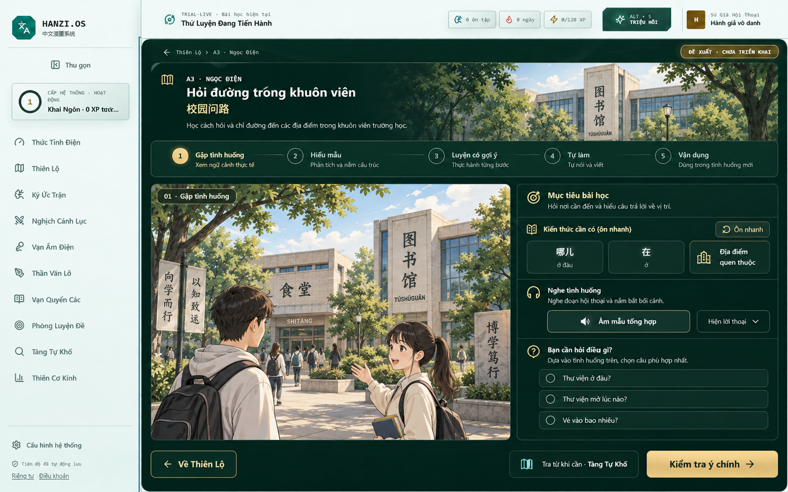
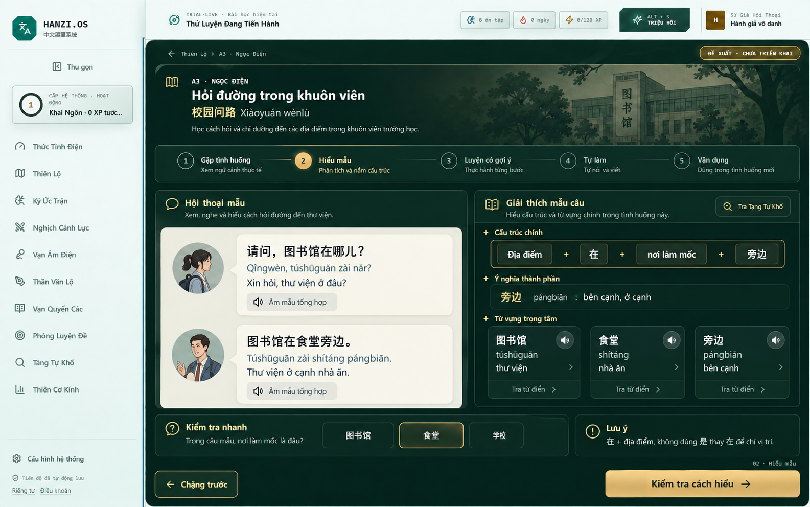
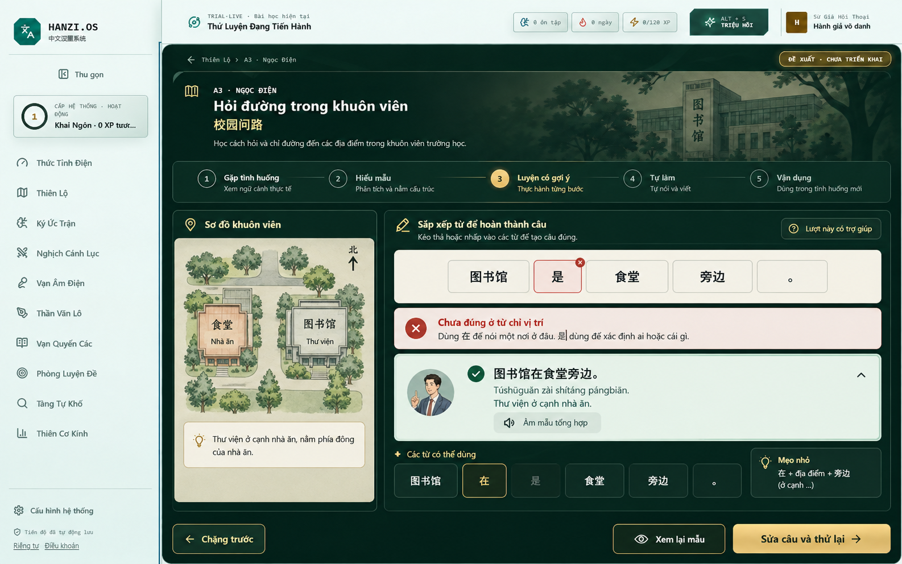
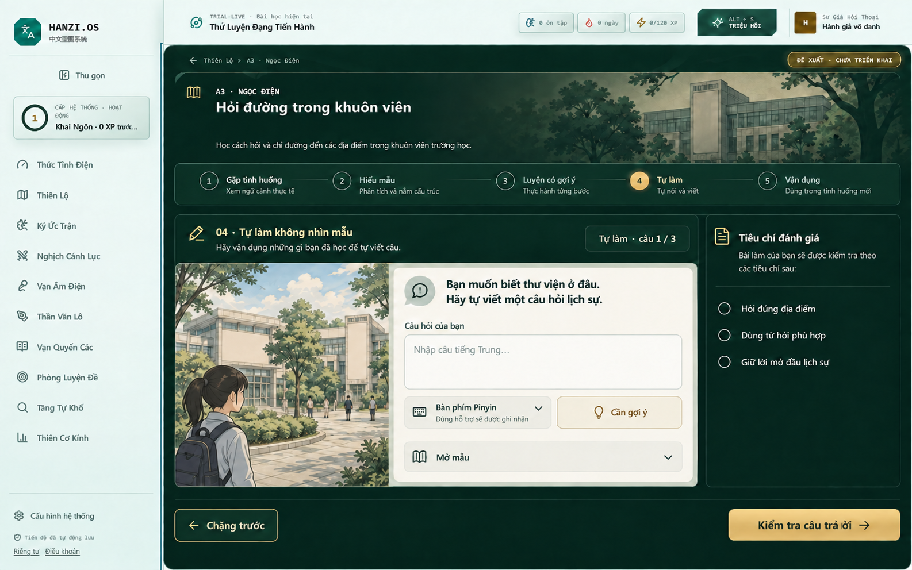
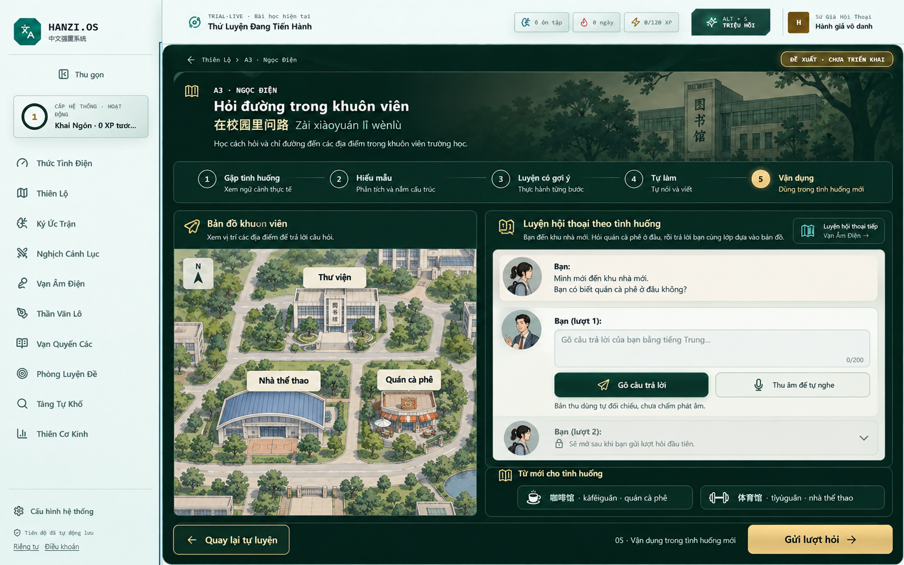
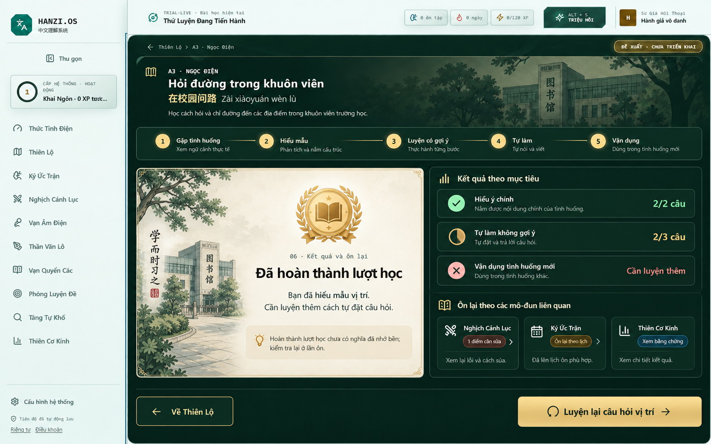
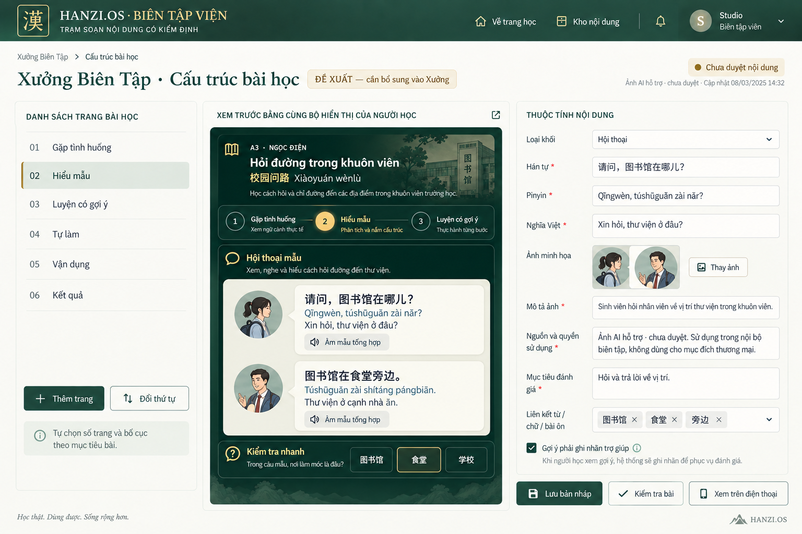

# Thư viện ảnh mẫu để đối chiếu

Ảnh đã tạo ở các lượt trước, được sao chép vào hồ sơ để đọc offline. Không sinh ảnh mới cho hồ sơ. Đây là concept AI, chưa phải web hoàn chỉnh. Nội dung chuẩn ở tài liệu 02.

## Trang 1 — Gặp tình huống

Concept: tranh + nhiệm vụ. Chữ nhỏ trong tranh không dùng làm học liệu chuẩn.

## Trang 2 — Hiểu mẫu

Concept: hội thoại và giải thích cấu trúc. Mục đích là tỷ lệ bố cục/phân cấp, không sao chép raster vào web.

## Trang 3 — Sửa lỗi có hướng dẫn

Concept có câu sai có chủ đích với 是, cần feedback giải thích và thử lại.

## Trang 4 — Tự làm

Bản đã bỏ chữ gợi đáp án trên biển hiệu và banner; khác bản cũ có lộ từ đích.

## Trang 5 — Vận dụng

Concept: bản đồ mới. Cần sửa nhãn hai vai và loại bỏ chữ không cần trên biển hiệu khi triển khai.

## Trang 6 — Kết quả và ôn

Số 2/2, 2/3 và lỗi là minh họa, không phải dữ liệu tài khoản; không suy mastery.

## Xưởng — Trình soạn đề xuất

Concept ba vùng và preview chung. Nhãn quyền dùng/ngày/header do ảnh sinh không phải chính sách; đọc đặc tả Xưởng.

